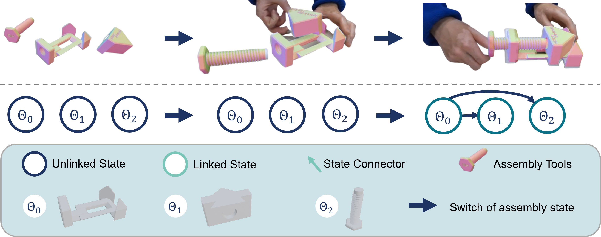

# GBOT: Graph-Based 3D Object Tracking for Augmented Reality-Assisted Assembly Guidance

## Publication in proceding
[Arxiv](https://arxiv.org/pdf/2402.07677.pdf)

## Introduction
Guidance for assemblable parts is a promising field for the use of augmented reality. Augmented reality assembly guidance requires 6D object poses of target objects in real-time. Especially in time-critical medical or industrial settings, continuous and markerless tracking of individual parts is essential to visualize instructions superimposed on or next to the target object parts. In this regard, occlusions by the user's hand or other objects as well as the complexity of different assembly states complicate robust and real-time markerless multi-object tracking. 

<a href="https://www.youtube.com/watch?v=kzg_SJPDdwI">

 
      
    <em>GBOT presentation</em>

</a>

## Synthetic Generation
The first step is to install [BlenderProc](https://github.com/DLR-RM/BlenderProc).
To install the local project:

    cd BlenderProc
    pip install -e .

Some additional packages are required but since BlendeProc runs in its own environment they have to be installed there.
Use:

    blenderproc pip install tqdm
    blenderproc pip install rasterio

Next step is to download the newest textures for the backgrounds:

    python blenderproc download cc_textures resources/cctextures    

Everything else what is needed is saved in the "Synthetic_data_generation/resources" folder.
Now the synthetic data generation should be ready to run. See therefore the next two sections.

Also if you want to debug see the "BlenderProc/README.md" file.

## GBOT dataset
[Training data - Part 1](https://zenodo.org/records/10710192)

[Training data - Part 2](https://zenodo.org/records/10711596)

[Training data - Part 3](https://zenodo.org/records/10712475)

[Test data](https://zenodo.org/records/10712703)

## Object Detection and 6D Pose Estimation
**1.** Install pytorch from https://pytorch.org/ by using the command provided there. Installation of pytorch before Ultralytics is important!

**2.** Install YOLOv8 by using:

    pip install ultralytics

For further instructions see: https://github.com/ultralytics/ultralytics

Additional packages will probably also be necessary but just install them based on their error message.

**3.** Probably you have to change the yolo settings. Use in the command line:
    
    yolo settings

to get the path where the settings are located and then change the "datasets_dir", "weights_dir" and "runs_dir" to your needs.
Recommended where PATH_TO_PROJECT is the Path where the project is located on your machine:

    datasets_dir: PATH_TO_GBOTdatasets
    weights_dir: PATH_TO_PROJECT\yolov8\weights  
    runs_dir: PATH_TO_PROJECT\yolov8\runs 

**4.** Start training with the script (You can skip this step if you want to use our pretrained models):

Train 6D object pose estimator with YOLOv8pose:

    python yolov8/yolov8_pose_training.py

 After the training, export the model into onnx format:

    from ultralytics import YOLO
    model = YOLO('yolov8pose.pt')  # load an official model
    model = YOLO('path/to/best.pt')  # load a custom trained model
    model.export(format='onnx')

**5.** Predict 6D object pose with YOLOv8

Download our [pretrained models](https://zenodo.org/records/10688659) in onnx format and save the pretrained models in the folder: yolov8pose/pretrained

You can predict 6D object poses with the script:

    python yolov8pose/yolo_to_pose_prediction_cv2.py

## Graph-base Object Tracking

## Build
Use [CMake](https://cmake.org/) to build the library from source. The following dependencies are required: [Eigen 3](https://eigen.tuxfamily.org/index.php?title=Main_Page), [GLEW](http://glew.sourceforge.net/), [GLFW 3](https://www.glfw.org/), and [OpenCV 4](https://opencv.org/). In addition, unit tests are implemented using [gtest](https://github.com/google/googletest), while images from an Azure Kinect or RealSense camera can be streamed using the [K4A](https://github.com/microsoft/Azure-Kinect-Sensor-SDK) and [realsense2](https://github.com/IntelRealSense/librealsense) libraries. All three libraries are optional and can be disabled using the *CMake* flags `USE_GTEST`, `USE_AZURE_KINECT`, and `USE_REALSENSE`. If [OpenCV 4](https://opencv.org/) is installed with [CUDA](https://developer.nvidia.com/cuda-downloads), feature detectors used in the texture modality are able to utilize the GPU. If *CMake* finds [OpenMP](https://www.openmp.org/), the code is compiled using multithreading and vectorization for some functions. Finally, the documentation is built if [Doxygen](https://www.doxygen.nl/index.html) with *dot* is detected. Note that links to pages or classes that are embedded in this readme only work in the generated documentation. After a correct build, it should be possible to successfully execute all tests in `./gtest_run`. For maximum performance, ensure that the library is created in `Release` mode, and, for example, use `-DCMAKE_BUILD_TYPE=Release`.
[Restful API]: https://github.com/Corvusoft/restbed

## Evaluation
The code in `gbot_tracking/examples/evaluate_gbot_dataset.cpp` contains file for model inference and tracking, results of 6D pose will be saved to result_pose_path according to your setting.

We use bop toolkit to evaluate the final results, please install bop toolkit from https://github.com/thodan/bop_toolkit.

Evaluate accuracy of 6d pose run: 
    python evaluation/eval_calc_errors.py

Visualize estimated pose run: 
    python evaluation/vis_est_poses.py

## Demo
The code in `gbot_tracking/examples/run_assembly_demo.cpp` contains file for real-time demo.
